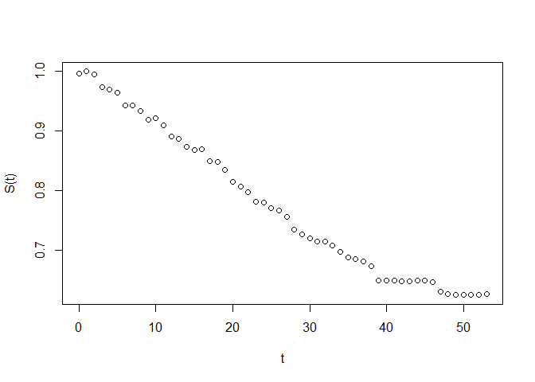

<!-- README.md is generated from README.Rmd. Please edit that file -->

# SurvivalCurveExtraction

<!-- badges: start -->

[](https://www.tidyverse.org/lifecycle/#experimental)
<!-- badges: end -->

This repository contains the codes necessary to produce an interactive
[shiny dash
board](https://pharmacoecon.shinyapps.io/SurvivalCurveExtraction/). The
original [Guyot et
al’s](https://bmcmedresmethodol.biomedcentral.com/articles/10.1186/1471-2288-12-9)
code is embedded in the dashboard. The original purpose of the document
was to serve as the analysis toolkit for generating survival
distribution parameters and fit statistics for health technology
assessment (HTA) or cost-effectiveness analysis of pharmaceutical
interventions.

## Purpose

1.  Allowing user to input datasets (as **.csv** files) and provide
    summary statistics of simulated Individual Patient Data (**IPD**)
    generated from survival plots of other studies.

2.  Users can specify which distributions to include (e.g. Weibull,
    Gompertz, and even Splines).

3.  Graphical display of the Kaplan-Meier plot and fitted parametric and
    semi-parametric distributions can also be extracted through the
    dashboard.

4.  Parameters of the parametric distributions and fit statistics can be
    obtained..

## Installation

You can install the released version of SurvivalCurveExtraction from
[CRAN](https://CRAN.R-project.org) with:

``` r
install.packages("SurvivalCurveExtraction")
```

This package won’t likely be released so…

``` r
# devtools::install_github("ck2136/SurvivalCurveExtraction")
```

## Directions

There ar 3 main steps for extracting survival distribution parameters:

1.  Digitize the survival curve
2.  Create **.csv** files
3.  Input the **.csv** files to generate best fitting curve to generated
    survival data

### 1\. Digitizing the Survival Curve

1.  **Before** embarking on the use of the dashboard, the user is
    required to have the necessary data files extracted from previous
    studies as described in [Guyot et
    al](https://bmcmedresmethodol.biomedcentral.com/articles/10.1186/1471-2288-12-9).
    The first dataset should look like below:

<!-- end list -->

``` r
df1 <- read.csv(paste0(here(),"/data-raw/digitized_data.csv"), header = FALSE)
df1 %>%
  head %>%
  kable 
```

| V1 |        V2 |
| -: | --------: |
|  0 | 0.9954050 |
|  1 | 0.9988023 |
|  2 | 0.9946494 |
|  3 | 0.9729813 |
|  4 | 0.9683260 |
|  5 | 0.9635587 |

The first 6 rows of the **.csv** file is shown to illustrate that as
\(t\) goes from 0 to \(T\), the value of \(S(t)\) should be monotone
decreasing from \(1\) to \(0\).

This file can be extracted from the website
[WebPlotDigitizer](https://automeris.io/WebPlotDigitizer/). In fact
let’s walk through one example of a study using [maintenance Olaparib
in patients with newly diagnosed advanced Ovarian
cancer](https://www.nejm.org/doi/full/10.1056/NEJMoa1810858). The
survival curve that we’re going to try to extract is the Progression
Free Survival (PFS) curve for patients that were using Olaparib.


Once you download/extract the file from the website, you now want to
click the `Launch` button and load the image. You’ll see a screen like
below:


Once the file is loaded and you select the Plot Type as `2D (X-Y) Plot`
click on the `Align Axes` button.


The next step is to select the points `X1`,`X2`, `Y1`, and `Y2` and then
input the numeric values as a reference point.


`Proceed`\! **TIP:** Once you select each point, you can move the points
around (in order to make better calibrations) by using the keyboard
arrow keys.

Once you are done with selecting each of the points mentioned above,
click on the `Complete!` button. You’ll see a box appear where now you
enter in the values for each of the points `X1`,`X2`, `Y1`, and `Y2`.
For this exercise we want \(X1 = Y1 = 0\) and \(X2 = 57\) and
\(Y2 = 1\).


Now that we’ve set the reference points for our data points, now we need
to select the data points that is to be recorded. On the right had side
of the screen there are 4 buttons next to `Mask`. Usually for these
exercises I use a pen and draw over the line that I’ll be extracting as
such:


Once you’ve drawn over the curve make sure the `Foreground Color` is the
appropriate color of the data points.


Now click on `Run` and you’ll see that red dots are generated\! We’re
almost done\! At this point we can play around with the `Algorithm` to
determine if we want to add more points or reduce the number of points.
Once you feel ready, we can go to the left hand side of the website and
click on `View Data`. Since we aren’t too concerned about going down to
\(>5\) digits, I usually format the code to have \(5\) fixed digits.
(Click on the `Format` button after selecting `Fixed` Digits). Then ou
can download the **.csv** file. I’ve named it `moore_b_ola.csv`.

We’ve successfully digitized the curve data hooray\!\!\!

### Create **.csv** Files

#### Data check for monotone decreasing

This step is very important as this is the part where we are going to
check the data for any inconsistencies. This data will later be used to
generate survival distribution parameters for simulations that will
impact the results\! Typically the results will be identifying whether
or not a certain treatment is more cost-effective compared to another.
If we do a poor job in this step, the results of this study will **NOT**
be appropriate and will lead to **BIASED** and **INCORRECT**
conclusions. Let’s do a good job in terms of data checking such that our
efforts here will yield appropriate conclusions.

The main point of this step is to identify if our data points are
non-increasing (ideally decreasing as per a usual survival curve). One
can visually check the data by plotting and also numerically check the
data. Below is a plot of the \(S(t)\) by \(t\).

``` r
plot(df1$V1, df1$V2, xlab = "t", ylab = "S(t)")
```



It’s clear that the second data point has a greater \(S(t)\) value
compared to the first data point. This clearly needs to be adjusted. As
all survival curves usually have the first point as \(S(t) = 1\), we
should replace the value to be 1. The code `monotone_check()` takes the
original **.csv** file and converts it to a data file with \(S(t)\) as
being monotone decreasing. Below it is in action:

``` r
df1 %>%
  head
#>   V1        V2
#> 1  0 0.9954050
#> 2  1 0.9988023
#> 3  2 0.9946493
#> 4  3 0.9729813
#> 5  4 0.9683260
#> 6  5 0.9635587

df1edited <- monotone_check(df1)
par(mfrow=c(1,2))
plot(df1$V1, df1$V2, xlab = "t", ylab = "S(t)", main = "Original")
plot(df1edited$Time, df1edited$`S(t)`, xlab = "t", ylab = "S(t)", main = "Data Checked")
```


For convenience, the `monotone_check()` function has been implemented in
the shinyapp so if the user doesn’t want to deal with it manually, the
application will deal with it foryou. (The user should still do a data
check to make sure that the \(S(t)\) are monotone decreasing).

Once the data has been checked for monotone decreasing, we can go ahead
and use the cleaned `df1edited` file as our first file indicated by
Guyot et al. The next **.csv** file needs to look like below:

``` r
df2 <- read.csv(paste0(here(),"/data-raw/digitized_nrisk.csv"), header = TRUE)
df2 %>%
  kable 
```

| Rownumber | Time | Lower.index | Upper.index | Number.at.risk |
| --------: | ---: | ----------: | ----------: | -------------: |
|         1 |    0 |           1 |           3 |            260 |
|         2 |    3 |           4 |           6 |            238 |
|         3 |    6 |           7 |           9 |            226 |
|         4 |    9 |          10 |          12 |            216 |
|         5 |   12 |          13 |          15 |            206 |
|         6 |   15 |          16 |          18 |            196 |
|         7 |   18 |          19 |          21 |            190 |
|         8 |   21 |          22 |          24 |            178 |
|         9 |   24 |          25 |          27 |            170 |
|        10 |   27 |          28 |          30 |            150 |
|        11 |   30 |          31 |          33 |            137 |
|        12 |   33 |          34 |          36 |            132 |
|        13 |   36 |          37 |          39 |            108 |
|        14 |   39 |          40 |          42 |             82 |
|        15 |   42 |          43 |          45 |             42 |
|        16 |   45 |          46 |          48 |             34 |
|        17 |   48 |          49 |          51 |              3 |
|        18 |   51 |          52 |          54 |              2 |
|        19 |   54 |          55 |          57 |              0 |

  - The columns need be as such:
    
      - Column 1: Row Number.
    
      - Column 2: Time in Months.
    
      - Column 3: Lower interval.
    
      - Column 4: Upper interval.
    
      - Column 5: Number at risk.

The values in each of the columns should reflect that of the values that
are from the number at risk information from the original survival
curve. At \(t = 0\), the number at risk for the Olaparib group is
\(260\). So our interval for number at risk during this period will be
\([0, 3)\). The Lower index value (**Column 3**) should correspond to
the index value in `df$edited$Index` which is 1. The Upper index value
(**Column 4**) should be just before 3, in our case therefore should be
\(t = 2.5\) which corresponds to \(\text{index} = 6\). Therefore,
following along this logic, the user needs to create a **.csv** file
that looks like `df2`.

Once the file has been created, we are ready to insert these **.csv**
files into the dashboard\!

### Input the **.csv** files to generate best fitting curve to generated survival data

There are several ways that one could start the dashboard application:

1.  Use
    [shinyapps.io](https://pharmacoecon.shinyapps.io/SurvivalCurveExtraction/)
2.  Clone/Fork the [github
    repo](https://github.com/ck2136/SurvivalCurveExtraction) and run the
    application using
    [Rstudio](https://rstudio.com/products/rstudio/download/#download)

Since it’s easier to use the web-application. I’m going to go with the
server. Click to access
[shinyapps.io](https://pharmacoecon.shinyapps.io/SurvivalCurveExtraction)

In the Introduction tab there is a guideline that everyone should be
able to follow.


The introduction is short and should be read everytime to reinforce the
requirements for the extraction of the survival parameter estimates, the
assumptions, and the workflow.

In the `Data Input and Summary` tab, we can enter our two `.csv` files
created. The [`/data-raw/`]() folder should have the files
`digitized_data.csv` and `digitized_nrisk.csv` for tutorial purposes.
Select the appropriate columns that represent \(S(t)\) and \(t\). The
numbes of events are \(102\) in the original study but you may play
around with that value to see how the parameters change.

*Note:* You will also notice that the `Results` tabe will show up once
you enter in both `.csv` files.


The `Results` tab will show

1.  Parameter estimates
2.  Fit Statistics
3.  Plots

With appropriate (monotone decreasing data that is sensible) data, the
desired outcomes should be achieved.


## Contact

If there are any questions please do not hesitate to contact
[me](mailto:chong.kim@ucdenver.edu)

## Code of Conduct

Please note that the ‘SurvivalCurveExtraction’ project is released with
a [Contributor Code of Conduct](CODE_OF_CONDUCT.md). By contributing to
this project, you agree to abide by its terms.
